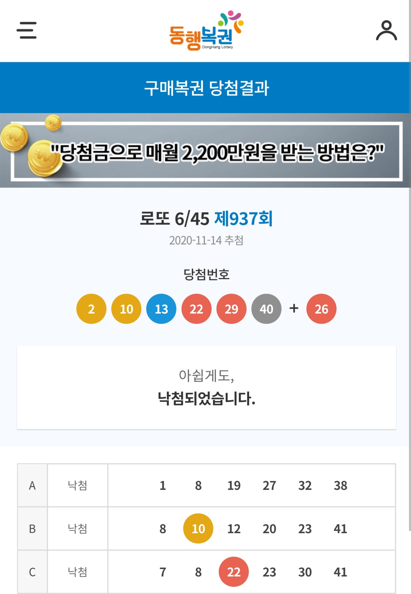
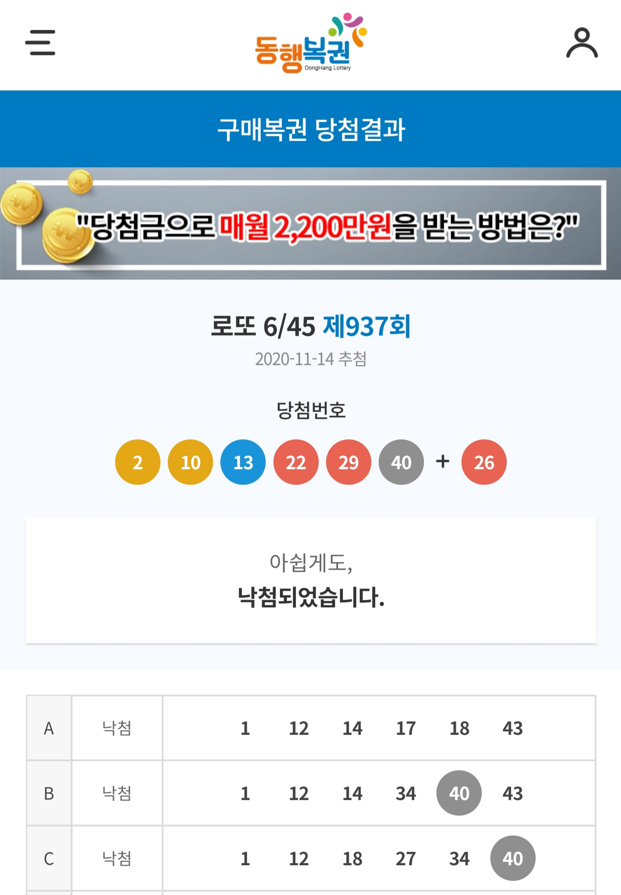

# DOTTO 프로젝트

프로젝트 시작 2020년 11월 09일
 
프로젝트 종료 2020년 11월 23일

 
 

**프로젝트 인원**
|소속|이름|
|------|---|
|Play Data*자율주행반|**마가진**
|Play Data*자율주행반|**이도원**
|Play Data*자율주행반|**신준호**
|Play Data*자율주행반|**편효범**

 
 

# 목차

1. 프로젝트 소개 및 주제 **선정**이유

2. 프로젝트 **아이디어** 그리고 구축을 위한 로드맵 및 도구

3. 프로젝트 **기대효과**

4. 프로젝트 **시연**

5. 프로젝트 **결과**

6. 결론 및 피드백

 
 

# 1️. 프로젝트 소개 및 주제 선정이유

 

## 소개

: 크롤링을 이용한 **역대 로또번호 데이터** 를 추출하여 **가장 많이 뽑힌 번호** 10개를 조합한 로또 번호 생성 및 1등 당첨 판매점 위치 제공

 

## 선정 이유

: **현실** 과 **밀접된 주제** 및 결과를 보여주기 좋은 주제라고 생각했고 **지금까지 배워온 Python 언어** 를 통해 구현 하고자 함

 
 
 
 

# 2. 프로젝트 실현을 위한 구성도 및 개발에 사용된 도구

## 구성도

 
 

## 도구선정

- 로또 번호 생성기 (Python3.9 & Jupyter Notebook)
- 데이터 크롤링 (Selenium, BeautifulSoup, Requests)
- 데이터 분석 및 시각화 (NumPy, Pandas, Seaborn, Matplolib)
- 지도 시각화 (NumPy, Pandas, Folium, Requests)
- 웹페이지 구현 (Flask, HTML, CSS)
- 소스 관리 (GitHub)

 
 

## 변수 정의

### lotto_data_crawling.ipynb

 

### lotto_program.ipynb

### lotto_store_map.ipynb

### lotto_data_visualize.ipynb

 
 

## 일정 관리

 
 
 

# 3. 프로젝트 기대효과

- 로또 당첨을 원하는 사용자에게 이 프로그램을 무료 공급 및 의미있는 데이터를 기반으로 당첨 가능성 있는 **확률** 을 제공.

- 이 프로그램을 계속 사용하므로써 얻게되는 데이터를 이용해 더 가능성있는 **당첨 가능성 확률의 조합** 을 만들 수 있음

 
 
 

# 4. 프로젝트 시연

 

### 메인 화면 (로또 번호 생성)

 
 

### 역대 로또 데이터 분석 시각화

 
 

### 수도권의 로또 1등 당첨지점 지도

 
 

# 5. 결과

2020년 11월 13일 금요일에 랜덤 로또 번호 3장, 데이터 기반 로또 번호 3장 총 6장 구매 후 14일에 로또 당첨번호 확인 결과, 역대 로또 데이터 분석을 기반으로 한 10개의 번호 중 **40번** 만 유일하게 나왔다. 아래 결과에서 볼 수 있듯이 랜덤으로 추출한 번호나 데이터를 기반으로 추출한 번호나 결과에는 큰 차이가 없음을 확인할 수 있다.

### 랜덤 로또 번호 추출

 
 

### 데이터 기반 로또 번호 추출

 
 
 
 

# 6. 결론

- __부족한 데이터 표본__ 으로 1개 맞는 결과로  낙첨되었지만 첫 시도인만큼 1개 맞는 결과도 의미있다고
생각하며 앞으로 더 많은 데이터를 수집 및 번호를 추출 하는 과정을 여러방면으로 생각하여 __당첨 가능성__ 을 늘릴 수 있는 프로그램으로 만들어야 함.

