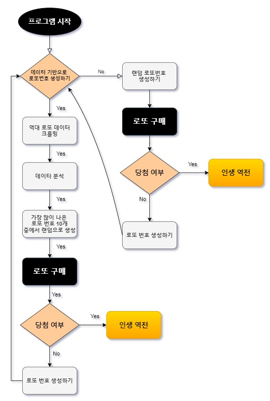

# 로또 번호 추출기 프로젝트 

프로젝트 시작 2020년 11월 09일 
 
프로젝트 종료 2020년 11월 23일

 
 

__프로젝트 인원__
|소속|이름|
|------|---|
|Play Data_자율주행반|**마가진**
|Play Data_자율주행반|**이도원**
|Play Data_자율주행반|**신준호**
|Play Data_자율주행반|**편효범**

 
 

# 목차

1. 프로젝트 소개 및 주제 **선정**이유

2. 프로젝트 **아이디어** 그리고 구축을 위한 로드맵 및 도구

3. 프로젝트 **기대효과** 

4. 프로젝트 **시연** 

5. 프로젝트 **결과**

6. 결론 및 피드백

 
 

# 1️. 프로젝트 소개 및 주제 선정이유

 

## 소개 
: 크롤링을 이용한 __역대 로또번호 데이터__ 를 추출하여  __가장 많이 뽑힌 번호__ 10개를 조합한 로또 번호 생성기

 

## 선정 이유 
: __현실__ 과 __밀접된 주제__ 및 결과를 보여주기 좋은 주제라고 생각했고 __지금까지 배워온 Python 언어__ 를 통해 구현 하고자 함

 
 
 
 

# 2. 프로젝트 실현을 위한 로드맵 및 도구 선정

## 로드맵 

 
  

## 도구선정 
- 로또 번호 생성기 (Python3.9 & Jupyther Notebook)
- 데이터 크롤링 (Selenium, BeautifulSoup, Requests)
- 데이터 분석 및 시각화 (NumPy, Pandas, Seaborn, Matplolib)
- 지도 시각화 (NumPy, Pandas, Folium, Requests)
- 웹페이지 구현 (Flask, HTML, CSS)
- 소스 관리 (GitHub) 

 
  

## 변수 정의

### lotto_data_crawling.ipynb

  

### lotto_program.ipynb

### lotto_store_map.ipynb

 
  

## 일정 관리

 
 
 

# 3. 프로젝트 기대효과

-  로또 당첨을 원하는 사용자에게 이 프로그램을 무료 공급 및 의미있는 데이터를 기반으로 당첨 가능성 있는 __확률__ 을 제공

-  이 프로그램을 계속 사용하므로써 얻게되는 데이터를 이용해 더 가능성있는 __당첨 가능성 확률의 조합__ 을 만들 수 있음

 
 
 

# 4. 프로젝트 시연

<iframe width="640" height="360" src="./video/video.mp4" frameborder="0" gesture="media" allowfullscreen=""></iframe>

<iframe width="640" height="360" src="https://j.gifs.com/jZp2El.gif" frameborder="0" gesture="media" allowfullscreen=""></iframe>

 

### 메인 화면

 
 

### 역대 로또 데이터값의 시각화 

 
 

### 수도권의 로또 당첨지점 맵

 

 
 

# 5. 결과

 
 

### 랜덤 값 추출

 
 

### 데이터 기반 값 추출

 
 
 
 

# 6. 결론

