# PROJECT DOTTO

2020.11.09 ~ 2020.11.23

 
 

**프로젝트 인원**
|소속|이름|
|------|---|
|Play Data 자율주행반|**마가진**
|Play Data 자율주행반|**이도원**
|Play Data 자율주행반|**신준호**
|Play Data 자율주행반|**편효범**

 
 

# 1️⃣ DOTTO 란

'인생 한 방' 이라는 로또 1등 당첨자의 소감을 보고 우리도 그 꿈의 실현을 위해 데이터를 기반으로 한 로또 번호 생성기를 만들어보는 것이 어떨까 라는 생각에 '데이터 기반 로또 번호 생성기'라는 주제를 이번 프로젝트의 주제로 선정하였습니다. 데이터를 기반한다는 뜻에서 로또의 L 대신 데이터의 D를 가져온 프로젝트 DOTTO는 1회부터 936회까지 추첨된 역대 로또 당첨번호들의 출현 빈도수 데이터를 바탕으로 로또 번호를 생성하는 프로그램으로 총 936회의 당첨 번호들 중에서 출현 빈도가 높은 10개의 번호를 선정하고 이 번호들 중에서 다시 6개의 번호를 무작위로 추출하는 알고리즘을 구현하고 있습니다.

 

### WEB_main

: 로또 번호를 제공하는 DOTTO의 첫 화면으로 GENERATE LOTTO 버튼을 누르면 무작위 번호 6개를 생성하고, GENERTAE DOTTO 버튼을 클릭하면 DOTTO의 알고리즘으로 구현된 번호를 6개 생성합니다.

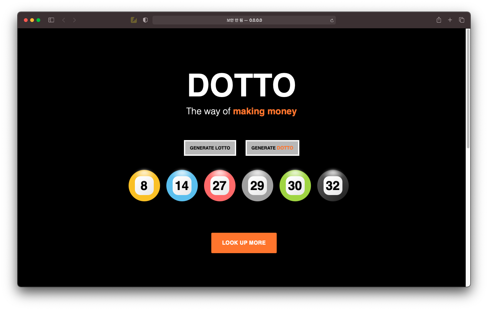

### WEB_page1

: 역대 로또 데이터 분석 시각화

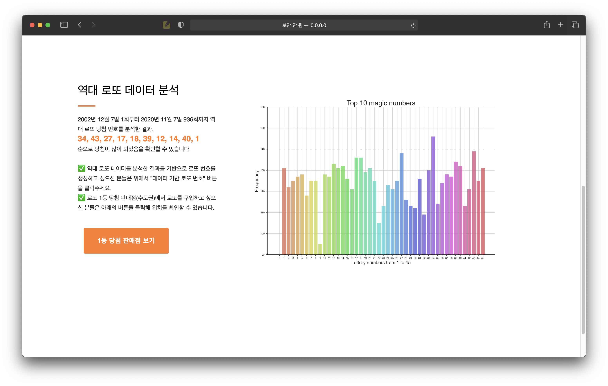

### WEB_page2

: 수도권의 로또 1등 당첨 판매점 지도 시각화

### DOTTO.gif

 
 

# 2️⃣ DOTTO 구현 과정

### DOTTO의 flowchart

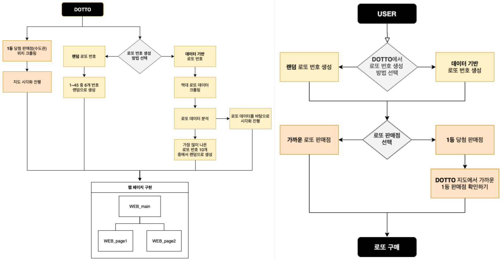

 
 

### 개발환경

- 개발 언어 & 통합 개발 환경

  : Python3.9 & Jupyter Notebook

- Python Modules
  - 크롤링 : Selenium, BeautifulSoup, Requests
  - 데이터 시각화 : NumPy, Pandas, Seaborn, Matplolib
  - 지도 시각화 : NumPy, Pandas, Folium, Requests
- WEB
  : Flask, HTML, CSS
- 소스 관리
  : GitHub

 
 

### 변수 정의

#### lotto_data_crawling.ipynb

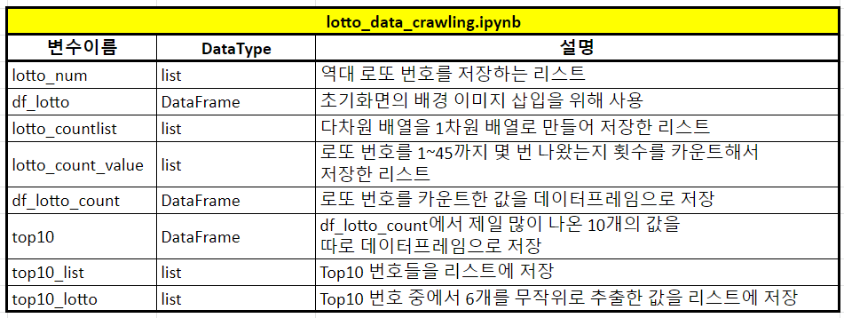

 

#### lotto_program.ipynb

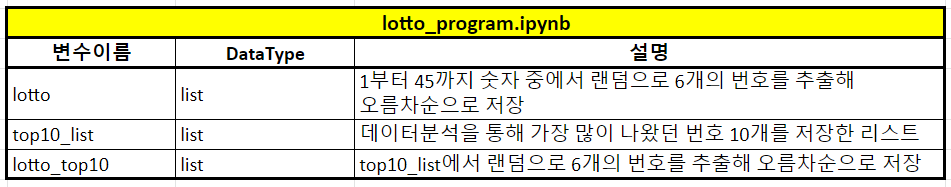

#### lotto_store_map.ipynb

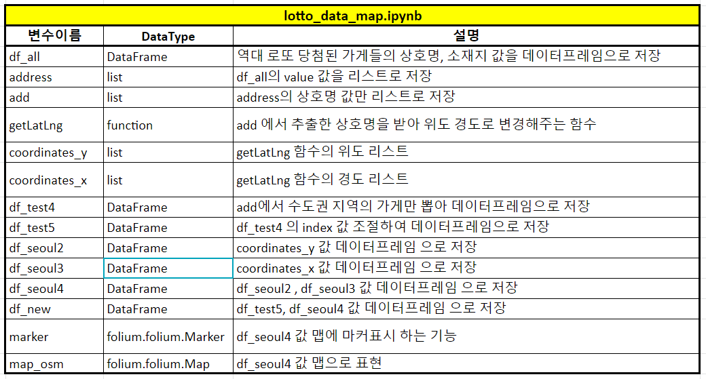

#### lotto_data_visualize.ipynb

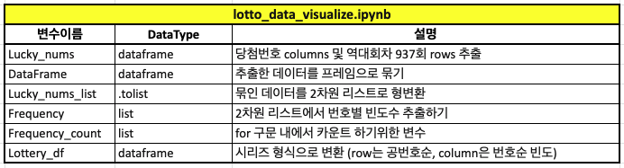

 
 

### 일정 관리

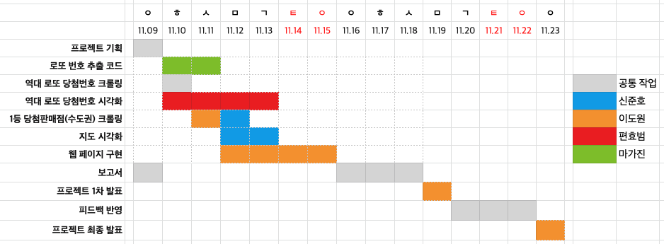

 
 
 

# 3️⃣ 실행 결과

2주에 걸쳐서 첫 주에는 DOTTO번호 3장, 두 번째 주에는 DOTTO번호 5장을 구매했으나 처음에는 번호 1개, 두 번째에는 번호가 하나도 맞지 않아 많이 아쉬운 결과를 확인할 수 있습니다.

 

### 2020.11.14 로또 구매 결과

- DOTTO 적용하지 않은 로또 결과

  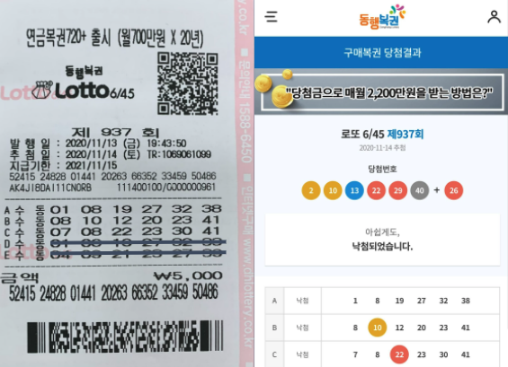

- DOTTO 적용한 로또 결과

  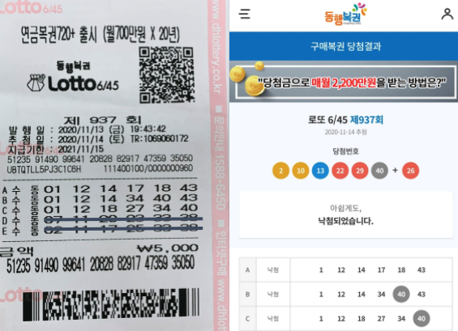

 

### 2020.11.21 로또 구매 결과

- DOTTO 적용한 로또 결과

  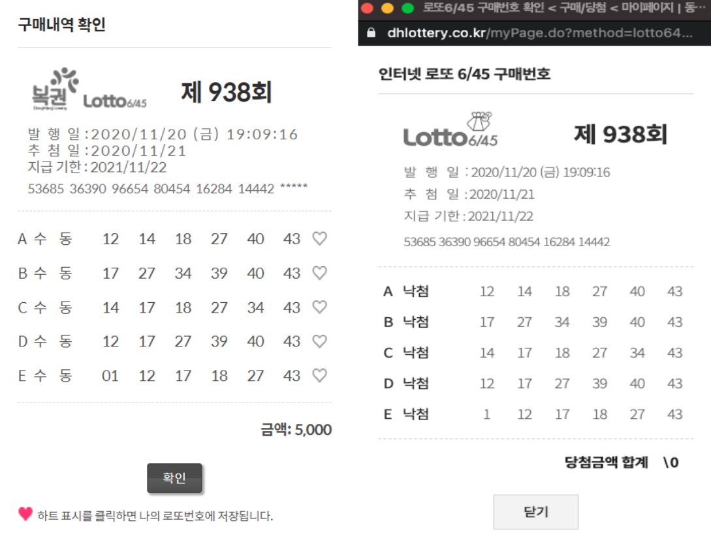

 
 

# 4️⃣ 종합결론

DOTTO 프로젝트의 결과에 있어 아쉬움이 남아 DOTTO와 비슷한 서비스를 제공하는 다른 업체를 분석해보고자 합니다.

구글에서 “로또번호”라는 키워드로 검색을 하면, 동행복권을 제외하고 [로또 리치]
구글에서 “로또번호”라는 키워드로 검색을 하면, 동행복권을 제외하고 [로또리치](http://www.lottorich.co.kr/)가 상위에 표시되는 것을 확인할 수 있습니다. 따라서 로또번호 제공 업체중 “로또리치”가 가장 활성화된 사이트라는 것을 확인할 수 있습니다. 주식회사 브레인콘텐츠에서 본 서비스를 제공하고 있으며, 브레인콘텐츠는 업력 23년차에 사원수는 58명에 달하는 중소기업입니다. 로또 1회차가 시행된 날이 2012년 9월 12일 입니다. 따라서 로또리치 서비스 제공자인 브레인콘텐츠는 로또번호 제공을 위해 설립된 회사가 아님을 알 수 있습니다. 브레인콘텐츠는 1998년에 초정밀가공 산업과 용지산업에 (주)하이산업 이라는 이름으로 진출 하여 2012년 아시아 태평양 복권협회 APLA 준회원 등록을 기점으로 복권관련 비즈니스를 준비하고 2017년 본격적으로 로또번호 제공 서비스인 로또리치를 제공한 것으로 보여집니다. 또한 2014년 미래창조과학부 정보보호관리체계 ‘ISMS보안인증’ 취득 기점으로 하드웨어 산업 대부분을 매각한뒤 본격적인 소프트웨어 회사로 전향 하였습니다.

로또 리치는 로또 정보 외에도 영화, 만화, 운세 등을 제공하고 있습니다. 이를 봤을 때 로또리치의 고객 세그먼트는 40~60대 남성으로 예측됩니다. 이 서비스는 일상에 지치고 가정을 꾸리기 위해 쉼없는 노동을 하는 가장에게 유료 컨텐츠를 제공하는 일종의 온라인 놀이터로 보여지고 있습니다.

**DOTTO 프로젝트는 본 사업의 시장 규모가 적지 않음을 확인 했습니다. 또한 복권 구매액은 매해 증가하고 있습니다. 로또리치의 비즈니스 캔버스를 참조하여 양질의 소비성 컨텐츠까지 함께 제공할 수 있다면 시장진입 및 월 결제에 의한 수익창출이 가능할 것으로 판단하고 있습니다.** 다만 수익이 실현되는 시점등 구체적인 사업계획을 수립하고 실제 시행하는데에는 꽤 많은 시간이 소요될 것으로 보입니다.
